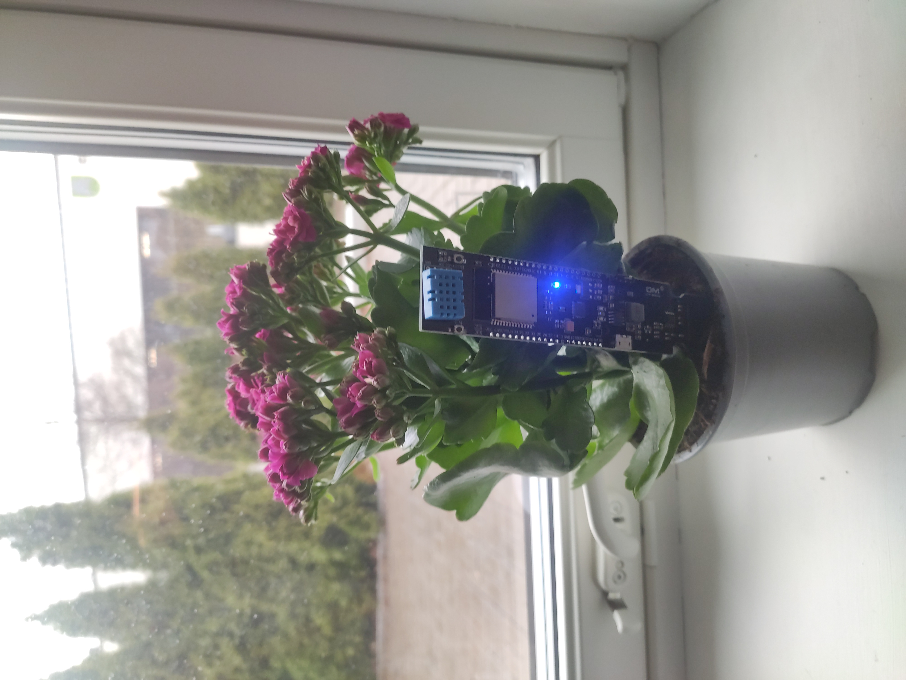
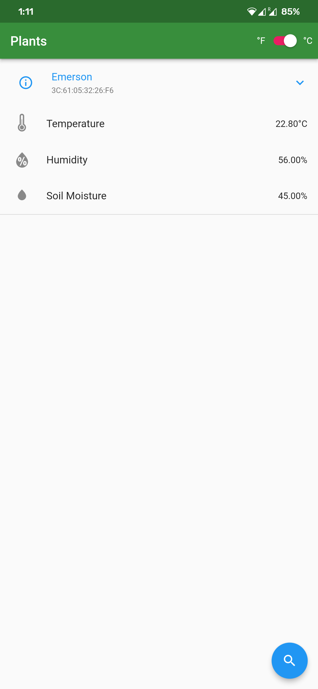
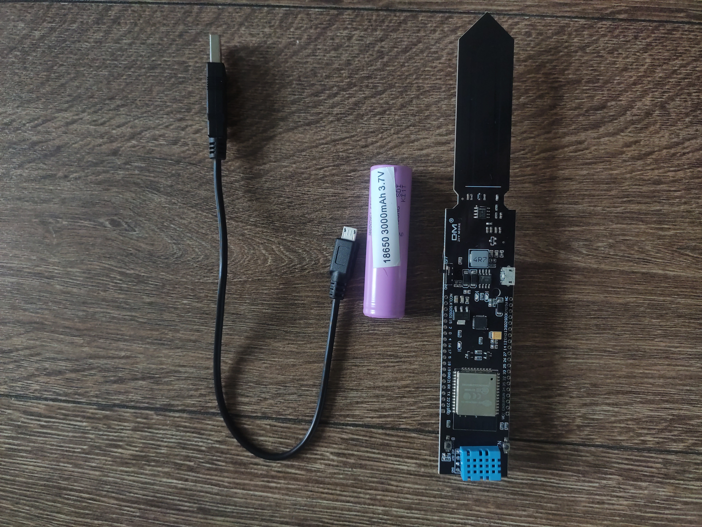

# Plant Sense

An Arduino project with an Android app to measure the soil moisture of your plants. 

Why? To know whether the plant is thirsty.

## Features

- Measures your plant's soil moisture, and ambient temperature/humidity.
- Reports data to the *Plant Sense* app via Bluetooth.
- The sensor saves energy by going into deep sleep between measurements.
- A blue light on the device notifies the user when the latest measurements can be read. 

## Requirements

### Hardware

- 1x [Soil Temperature Humidity Sensor](https://www.diymore.cc/collections/new-product/products/esp32-wifi-bluetooth-cp2104-dht11-soil-temperature-humidity-sensor-18650-battery-base)
- 1x 18650 Lithium Battery
- 1x USB Micro B cable

### Software 

- [esptool](https://docs.espressif.com/projects/esptool/en/latest/esp32/)

## Installation

1. Download the latest [release](https://github.com/reaper47/plant-sense/releases/tag/v1.0.0) and `cd` into it.
1. Connect your soil moisture sensor to your computer and flash the firmware. On Linux: `sudo esptool --chip esp32 --port "/dev/ttyUSB0" --baud 460800 --before default_reset --after hard_reset write_flash -z --flash_mode dio --flash_freq 40m --flash_size detect 0x1000 ./bootloader_dio_40m.bin 0x8000 ./partitions.bin 0xe000 ./boot_app0.bin 0x10000 ./firmware.bin`
1. Disconnect the device from the computer.
1. Slide the switch on the device to **off**, insert the 18650 lithium battery correctly, and slide the switch to **on**. 
1. Secure the device in soil.
1. Install the [Android app](https://github.com/reaper47/plant-sense/releases/tag/v1.0.0).

## Usage

1. Every five minutes, a bright, blue light will light up on the device to signal that data is ready to be read by the app.
1. Tap the search icon in the lower right corner of the app to list the plants.
1. Tap one of the plants in the list to see the readings.
1. After 30s, the device will go back to deep sleep, and the blue light will dim.

## Future Improvements

### Name of the Plant

This firmware is intended to be used for one plant only because the name of the
Bluetooth Device is `Plant: Emerson`, and the service and characteristic UUIDs
are the same for everyone. 

To change them, the user needs to:
1. Clone the repository
1. Open `src/main.cpp`
1. Change the variables `SERVICE_UUID`, `CHARACTERISTIC_UUID`, and `PLANT_NAME`.
1. Build the project with PlatformIO
1. Flash the firmware

OR

Send an email to [me](mailto:macpoule@gmail.com) with your desired name, and I will take care of it.

### Aural Signal

Add an aural signal, i.e. a beeper, to the device for it to beep when data is ready 
to be consulted in the app.
